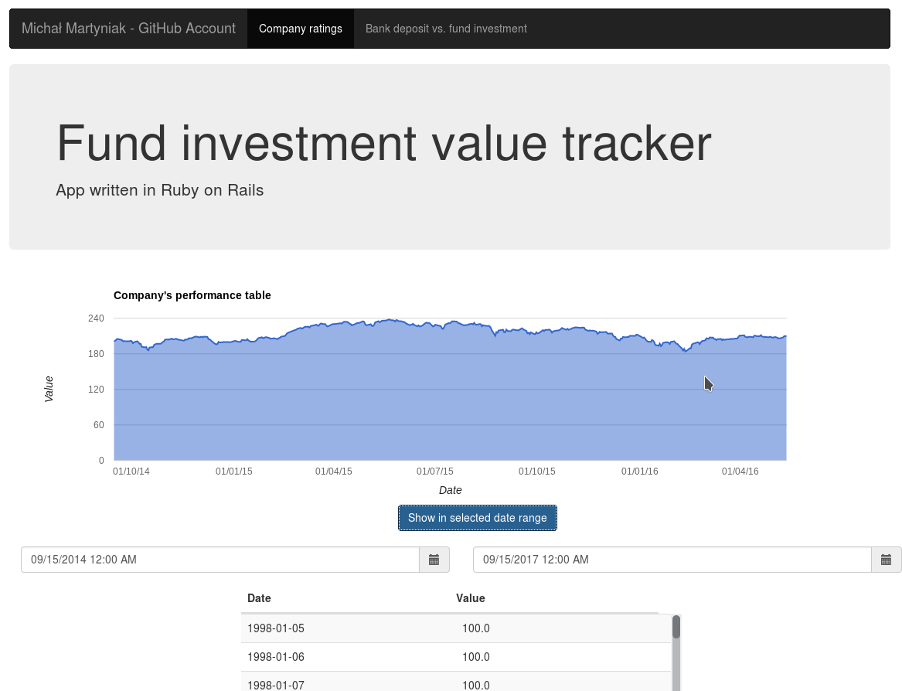
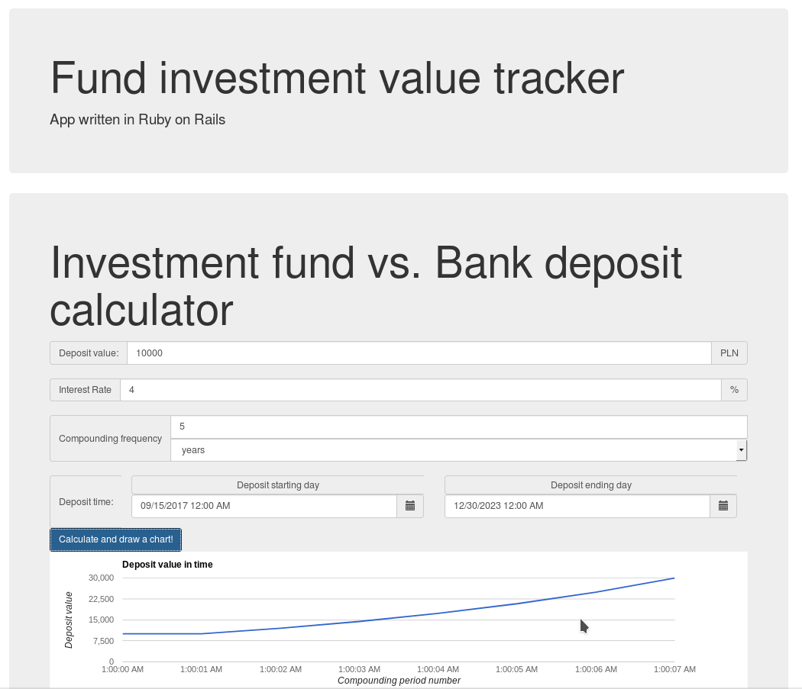

# Fund Tracker - toy app for recruitment process
This app is no longer maintained, but still deployable.

## Screens
Main Page             |  Second Page
:-------------------------:|:-------------------------:
  |  

## 1. Deployed at Heroku
https://fund-tracker-app-prototype.herokuapp.com/
<br>
## 2. Manual launch

### 2.1 Requirements:

- RVM could be useful for separating environments
- Ruby on Rails
- MySQL ~> 5.7
- libmysqlclient-dev

### 2.2 Commands

```bash
# 1
sudo apt install libmysqlclient-dev

### WARNING! you need to modify config/database.yml with your mysql root password after this step
sudo apt install mysql-server mysql-common mysql-client 

# 2. Install all gems
bundle

# 3. Database setup
rails db:create db:migrate
rake miczi:populate_db_with_csv

# 4. Run the server
rails server

# 5. Open in browser
http://localhost:3000 (by default)
```

## 3. TODO
[x] Use Rails  5
[x] Abandon PostgreSQL
[x] Describe 'how to run' process
[x] Add a CSV example file
[ ] Migrate to Docker in order to simplify the deployment

## 4. Rules were...

1. Given CSV file ```db/data.csv```
2. Create an app which would visualize the data
3. Additionaly prepare a calculator for calculating income generated by depositing given amount of money


